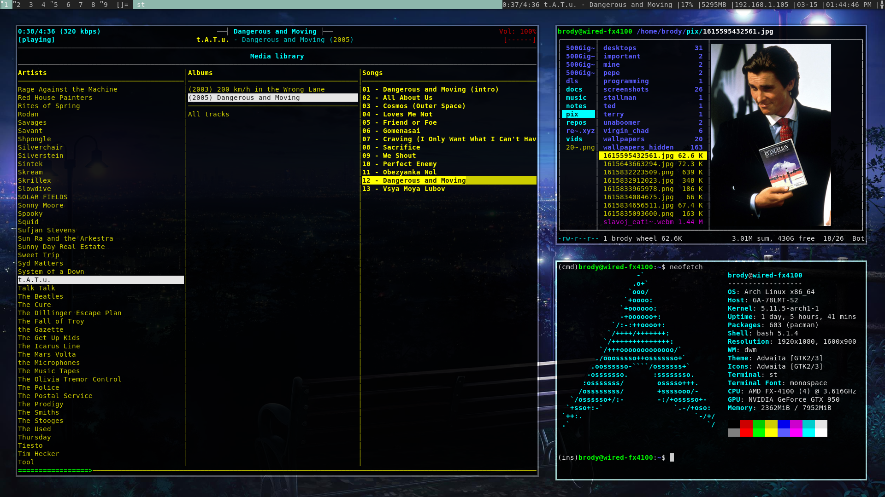

# rethyxyz-dwm
My build of dwm. Minimally patched. Contains altbar, transparency, fullscreen, and gaps patches. Supports XF86 keys.

## Preview

## Keybindings
Repeditive movements are bound to F1-12 keys:
- **F1**: Toggle fullscreen
- **F4**: Last frame as primary
- **F6**: Kill selected frame
See `config.h` for other keybindings.
